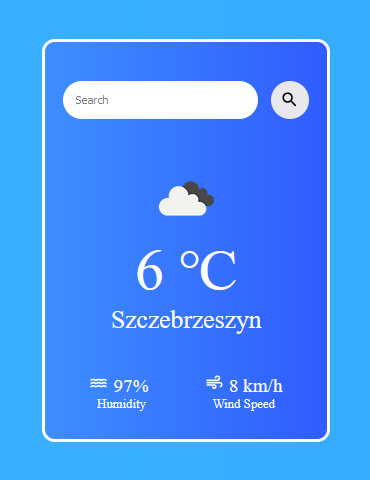

    <h2>Weather App preview</h2>

## How to install Weather App?

1. Common setup.
   Clone the repository and install the dependencies.
   - git clone https://github.com/Xenko10/weather-app.git
   - cd weather-app
   - yarn
2. Get API key.
   - create account on https://openweathermap.org/appid
   - create .env in weather-app folder
   - type: VITE_API_KEY="your API key from openweathermap" in .env file
3. Run the following.
   - yarn dev
   - open http://localhost:5173
